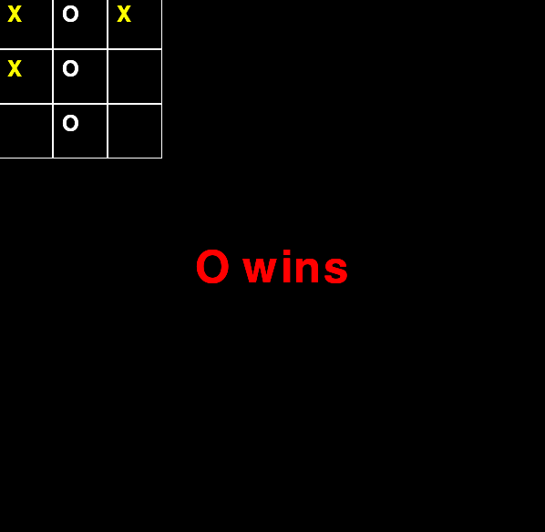

How to use
===========

The game we're going to make this time is the **Tic-Tac-Toe** game. The rules of the **Tik-Tac-Toe** game are as follows.

A **Tic-Tac-Toe** is a game in which two people alternately write O and X on a 3×3 board, placing the same letters horizontally, vertically, or diagonally. It's an m,n,k-game, (3,3,3)-game.

Simply put, the 3X3 screen alternates between magnetic shapes (O or X), and if three shapes of the same shape are placed in a row, it is a game that wins.